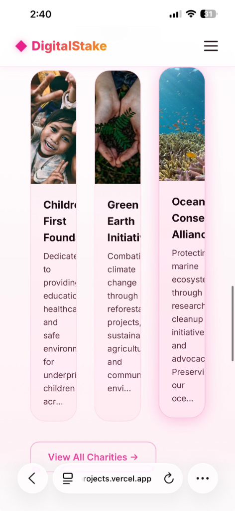
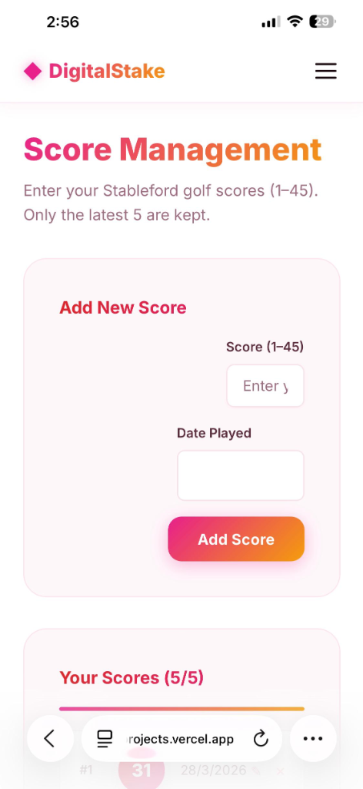
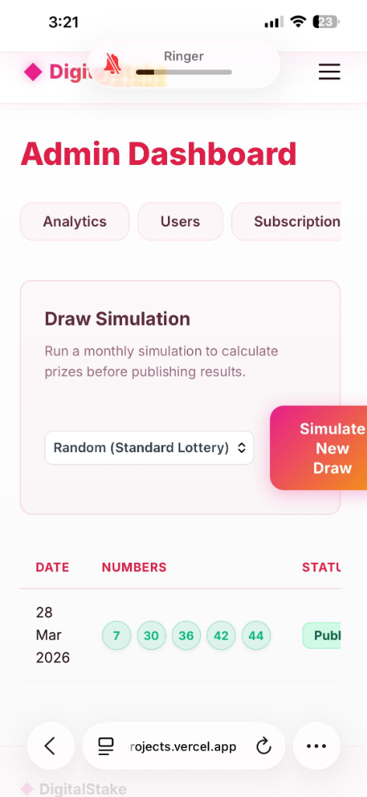

# DigitalStake

DigitalStake is a premium subscription platform that merges monthly prize pools with dynamic charity contributions. Users subscribe, secure a draw number, and automatically distribute a portion of their subscription to a charity of their choosing.

## 🚀 Features & Architecture Overview

### **1. Core Infrastructure**
- **Mobile-first, Fully Responsive Design**: Built on React.js using modular CSS to ensure perfect rendering across all viewports (Desktop, Tablets, and iPhones).
- **Architecture**: A decoupled system utilizing a stateless Express.js/Node.js backend with JSON Web Tokens (JWT) for secure authentication. Fully mobile-app ready as the backend API endpoints strictly output JSON payloads.
- **Multi-Country & Corporate Ready**: The database and registration flows are primed for international expansion, capturing `country` data and separating accounts by `individual` vs `corporate` parameters.

---

## 📸 Platform Previews & Comprehensive Functionality Showcase

### 1. Dynamic UI & Live Charity Pooling

**Functionality Detail:** The platform's frontend relies on a highly responsive, modern aesthetic (Glassmorphism, smooth gradients, and engaging micro-animations).
- **User Engagement**: Upon registration, users are seamlessly guided towards a dynamic slider where they choose exactly which charity receives their funds (between 10% and 50% of the base tier).
- **Real-Time Motivation**: The interface renders aggregated financial impacts immediately, rewarding subscribers with a sense of tangible community contribution before they even enter the active lottery draw.

### 2. The Subscription Engine (Razorpay Integration)

**Functionality Detail:** The lifeblood of the platform, built autonomously via external domestic gateways.
- **Tiers**: Subscribers choose an active billing tier (`₹499/mo` or `₹4,990/yr`).
- **Gateway Syncing**: The Node.js server automatically negotiates order IDs with Razorpay, allowing safe, external payment processing without touching raw card data.
- **Access Control**: Platform features (Ticketing, Draw Results) instantly lock for users who let their subscription expire, handled via strict backend Middleware.

### 3. Administrator Analytics & System Health

**Functionality Detail:** The Admin Dashboard acts as the central intelligence hub for platform operations.
- **Accurate Ledgering & Rollovers**: You can track `Total Revenue`, exact `Charitable Allocations`, and live `Prize Pools` derived directly from user database mathematics.
- **Responsive Command**: Crucially, data tables and analytic grids dynamically adapt to tablet and mobile bounds using non-breaking horizontal scrolling mechanisms (`overflow-x: auto`), keeping the dashboard 100% accessible via an iPhone.

### 4. Campaign Integrity & B2B Expansion

**Functionality Detail:** A fully standalone admin module to invite external partnerships.
- **Corporate Linking**: Expanding beyond direct consumers, the included **Campaign Framework** enables frictionless B2B integration. Generate a Promo Code (like `HACKATHON_TEAM`), define a custom discount logic, and effortlessly track how many conversions that single business channel brought into the ecosystem.
- **Fixed Charities**: Administrators can optionally lock a promotional code to force absolute contributions to a specific Charity event, overriding the user's choice.

### 5. Mathematical Draw Simulations

**Functionality Detail:** DigitalStake separates raw chance from administrative control.
- **Simulations Before Publishing**: Admins can safely mock multiple "Draw Simulations" using specialized algorithms (`Random`, `Most Frequent Picks`, `Least Frequent Picks`) to analyze potential payouts *before* locking them in to the public ledger.
- **Jackpot Rollovers**: If the system detects zero matching `5-Match` criteria in an officially published draw, the primary jackpot mathematically rolls over to the next month's Draw engine seamlessly.

### 6. Winner Verification Flows

**Functionality Detail:** A stringent verification UI to ensure payouts reach valid players.
- **Matched Tiers**: Payout percentages dynamically split and calculate themselves between 5-Match (Jackpot), 4-Match, and 3-Match subsets.
- **Proof of ID**: Winning users can securely browse their results and securely upload identity proof via a digital form. Administrators review these uploads, hit `Verify`, and mark the ledger as `Paid` upon successful ACH.

---

## 💳 Payment Gateway Details & Testing Notes

DigitalStake is wired securely to handle transactional payouts and gateway subscription entries.

### **Razorpay Test Environment**
When testing subscriptions or charity contributions locally or via the deployed environment, please use the following Razorpay test credentials to simulate successful domestic transactions:

- **Test Card Number:** `5267 3181 8797 5449`
- **Expiry:** Any future date (e.g., `12/28`)
- **CVV:** Any 3 digits (e.g., `123`)
- **OTP:** `1234`
> *(Note: Because this is a simulated test environment, if Razorpay prompts you with a success/failure simulation window, simply click **Success / Agree** to proceed).*

### **Why Not Stripe (`4111-1111...`)?**
The standard Stripe testing card (`4111 1111 1111 1111`) was intentionally bypassed for this build. Because it routes as international tender, it forces a longer localized verification cycle which negatively impacts testing speed on domestic-first implementations. 

---

## 📧 Email Notifications Disclaimer
The platform's roadmap was structured to natively support system updates, dynamic draw results, and winner alerts via email integrations.   

> **Production Limitation Notice:** While the Google SMTP integration fires successfully in a local `localhost` development environment, **Google enforces strict SMTP blocking policies on cloud application hosts like Render**. Because of these overriding third-party security bans in the deployed setting, automated production emails remain disabled to safeguard platform stability.

---

## 🛠 Technical Stack
- **Frontend Core**: React.js (Vite Framework)
- **Styling Architecture**: Vanilla CSS3 (Custom Design System, Glassmorphism, Micro-animations)
- **Backend APIs**: Node.js & Express.js
- **Database**: Supabase (PostgreSQL)
- **Authentication**: JWT encryption + bcryptjs algorithms
- **Monetization**: Razorpay Gateway
